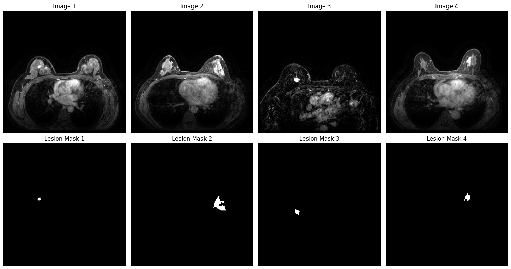

Dataset Preprocessing
=====================

To facilitate faster experimentation and reduce computational overhead,
all images and corresponding masks were downsampled to a resolution of
128 × 128 pixels. Additionally, pixel intensities were normalised to the
range [0 − 1] to ensure consistency across the dataset.

Loading required libraries

.. code:: ipython3

    import os
    
    import matplotlib.pyplot as plt
    import numpy as np
    import tensorflow as tf
    from sklearn.metrics import (accuracy_score, f1_score, precision_score,
                                 recall_score)

.. code:: ipython3

    # Define paths for training, testing, and validation datasets
    train_path = "/home/mn628/FEDERATED_LEARNING/new_database/seg/train"
    test_path = "/home/mn628/FEDERATED_LEARNING/new_database/seg/test"
    val_path = "/home/mn628/FEDERATED_LEARNING/new_database/seg/val"

.. code:: ipython3

    # path to save the training, testing, and validation data
    train_save = "/home/mn628/FEDERATED_LEARNING/data/train_images.npy"
    train_mask_save = "/home/mn628/FEDERATED_LEARNING/data/train_masks.npy"
    val_save = "/home/mn628/FEDERATED_LEARNING/data/val_images.npy"
    val_mask_save = "/home/mn628/FEDERATED_LEARNING/data/val_masks.npy"
    test_save = "/home/mn628/FEDERATED_LEARNING/data/test_images.npy"
    test_mask_save = "/home/mn628/FEDERATED_LEARNING/data/test_masks.npy"

Load the dataset
^^^^^^^^^^^^^^^^

.. code:: ipython3

    def load_data(path):
        """
        Load images and segmentations from the provided folder path.
        """
        images = []
        mebe = []
        for folder in os.listdir(path + "/images"):
            for folder1 in os.listdir(path + "/images/" + folder):
                for file in os.listdir(path + "/images/" + folder + "/" + folder1):
                    if 'Ma' in folder or 'Me' in folder:
                        mebe.append(1)
                    else:
                        mebe.append(0)
                    img = plt.imread(
                        path + "/images/" + folder + "/" + folder1 + "/" + file
                    )
                    images.append(img)
        segm = []
        for folder in os.listdir(path + "/labels"):
            for folder1 in os.listdir(path + "/labels/" + folder):
                for file in os.listdir(path + "/labels/" + folder + "/" + folder1):
                    img = plt.imread(
                        path + "/labels/" + folder + "/" + folder1 + "/" + file
                    )
                    segm.append(img)
        return images, segm, mebe

.. code:: ipython3

    train_images, train_segm, mebe_train = load_data(train_path)
    val_images, val_segm, mebe_val = load_data(val_path)
    test_images, test_segm, mebe_test = load_data(test_path)

.. code:: ipython3

    print("Number of malignant tumours in first half of training set:", np.sum(mebe_train[:len(mebe_train)//2]))
    print("Number of benign tumours in first half of training set:", np.sum(1 - np.array(mebe_train[:len(mebe_train)//2])))
    print("Number of malignant tumours in second half of training set:", np.sum(mebe_train[len(mebe_train)//2:]))
    print("Number of benign tumours in second half of training set:", np.sum(1 - np.array(mebe_train[len(mebe_train)//2:])))

.. parsed-literal::

    Number of malignant tumours in first half of training set: 7599
    Number of benign tumours in first half of training set: 2618
    Number of malignant tumours in second half of training set: 7276
    Number of benign tumours in second half of training set: 2941
    

.. code:: ipython3

    print("Number of malignant tumours in first half of validation set:", np.sum(mebe_val[:len(mebe_val)//2]))
    print("Number of benign tumours in first half of validation set:", np.sum(1 - np.array(mebe_val[:len(mebe_val)//2])))
    print("Number of malignant tumours in second half of validation set:", np.sum(mebe_val[len(mebe_val)//2:]))
    print("Number of benign tumours in second half of validation set:", np.sum(1 - np.array(mebe_val[len(mebe_val)//2:])))

.. parsed-literal::

    Number of malignant tumours in first half of validation set: 688
    Number of benign tumours in first half of validation set: 306
    Number of malignant tumours in second half of validation set: 893
    Number of benign tumours in second half of validation set: 102
    

Find and exclude the problematic image
^^^^^^^^^^^^^^^^^^^^^^^^^^^^^^^^^^^^^^

.. code:: ipython3

    lengths = [d.shape for d in train_images]
    
    suma, position, final_pos = 0, 0, 0
    for i in lengths:
        if i == (369, 369, 3):
            suma += 1
            final_pos = position
        position += 1
    
    suma, final_pos

.. code:: ipython3

    tr_img = train_images[:final_pos] + train_images[final_pos + 1 :]
    tr_segm = train_segm[:final_pos] + train_segm[final_pos + 1 :]
    
    len(train_images), len(train_segm), len(tr_img), len(tr_segm)

.. parsed-literal::

    (20434, 20434, 20433, 20433)

Data shape and samples
^^^^^^^^^^^^^^^^^^^^^^

.. code:: ipython3

    tr_img, tr_segm = np.array(tr_img), np.array(tr_segm)
    val_img, val_segm = np.array(val_images), np.array(val_segm)
    ts_img, ts_segm = np.array(test_images), np.array(test_segm)
    
    tr_segm.shape, tr_img.shape, val_img.shape, val_segm.shape, ts_img.shape, ts_segm.shape

.. parsed-literal::

    ((20433, 369, 369),
     (20433, 369, 369),
     (1989, 369, 369),
     (1989, 369, 369),
     (7089, 369, 369),
     (7089, 369, 369))

.. code:: ipython3

    imgs = [0, 1820, 1000, 800]
    plt.figure(figsize=(15, 8))
    plt.subplot(2, 4, 1), plt.imshow(train_images[imgs[0]], cmap="gray"), plt.title(
        "Image 1"
    ), plt.axis("off")
    plt.subplot(2, 4, 2), plt.imshow(train_images[imgs[1]], cmap="gray"), plt.title(
        "Image 2"
    ), plt.axis("off")
    plt.subplot(2, 4, 3), plt.imshow(train_images[imgs[2]], cmap="gray"), plt.title(
        "Image 3"
    ), plt.axis("off")
    plt.subplot(2, 4, 4), plt.imshow(train_images[imgs[3]], cmap="gray"), plt.title(
        "Image 4"
    ), plt.axis("off")
    plt.subplot(2, 4, 5), plt.imshow(train_segm[imgs[0]], cmap="gray"), plt.title(
        "Lesion Mask 1"
    ), plt.axis("off")
    plt.subplot(2, 4, 6), plt.imshow(train_segm[imgs[1]], cmap="gray"), plt.title(
        "Lesion Mask 2"
    ), plt.axis("off")
    plt.subplot(2, 4, 7), plt.imshow(train_segm[imgs[2]], cmap="gray"), plt.title(
        "Lesion Mask 3"
    ), plt.axis("off")
    plt.subplot(2, 4, 8), plt.imshow(train_segm[imgs[3]], cmap="gray"), plt.title(
        "Lesion Mask 4"
    ), plt.axis("off")
    plt.tight_layout()
    plt.show()

Normalisation and dimension adaptation
^^^^^^^^^^^^^^^^^^^^^^^^^^^^^^^^^^^^^^

.. code:: ipython3

    tr_img, val_img, ts_img = tr_img / 255.0, val_img / 255.0, ts_img / 255.0
    
    train_images, train_segmentation = np.expand_dims(tr_img, axis=-1), np.expand_dims(
        tr_segm, axis=-1
    )
    val_images, val_segmentation = np.expand_dims(val_img, axis=-1), np.expand_dims(
        val_segm, axis=-1
    )
    test_images, test_segmentation = np.expand_dims(ts_img, axis=-1), np.expand_dims(
        ts_segm, axis=-1
    )
    
    train_images.shape, train_segmentation.shape, val_images.shape, val_segmentation.shape, test_images.shape, test_segmentation.shape

.. parsed-literal::

    ((20433, 369, 369, 1),
     (20433, 369, 369, 1),
     (1989, 369, 369, 1),
     (1989, 369, 369, 1),
     (7089, 369, 369, 1),
     (7089, 369, 369, 1))

Resize input images (downsampling)
^^^^^^^^^^^^^^^^^^^^^^^^^^^^^^^^^^

.. code:: ipython3

    im_size = 128
    
    train_images, train_segmentation = tf.image.resize(
        train_images, [im_size, im_size]
    ), tf.image.resize(train_segmentation, [im_size, im_size])
    val_images, val_segmentation = tf.image.resize(
        val_images, [im_size, im_size]
    ), tf.image.resize(val_segmentation, [im_size, im_size])
    test_images, test_segmentation = tf.image.resize(
        test_images, [im_size, im_size]
    ), tf.image.resize(test_segmentation, [im_size, im_size])
    
    train_images.shape, train_segmentation.shape, val_images.shape, val_segmentation.shape, test_images.shape, test_segmentation.shape

.. parsed-literal::

    2025-02-18 02:54:09.566582: E external/local_xla/xla/stream_executor/cuda/cuda_driver.cc:152] failed call to cuInit: INTERNAL: CUDA error: Failed call to cuInit: CUDA_ERROR_NO_DEVICE: no CUDA-capable device is detected
    

.. parsed-literal::

    (TensorShape([20433, 128, 128, 1]),
     TensorShape([20433, 128, 128, 1]),
     TensorShape([1989, 128, 128, 1]),
     TensorShape([1989, 128, 128, 1]),
     TensorShape([7089, 128, 128, 1]),
     TensorShape([7089, 128, 128, 1]))

.. code:: ipython3

    np.save(train_save, train_images)
    np.save(train_mask_save, train_segmentation)
    np.save(val_save, val_images)
    np.save(val_mask_save, val_segmentation)
    np.save(test_save, test_images)
    np.save(test_mask_save, test_segmentation)
