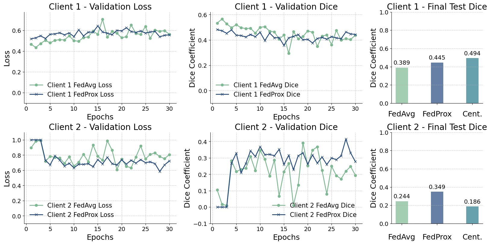
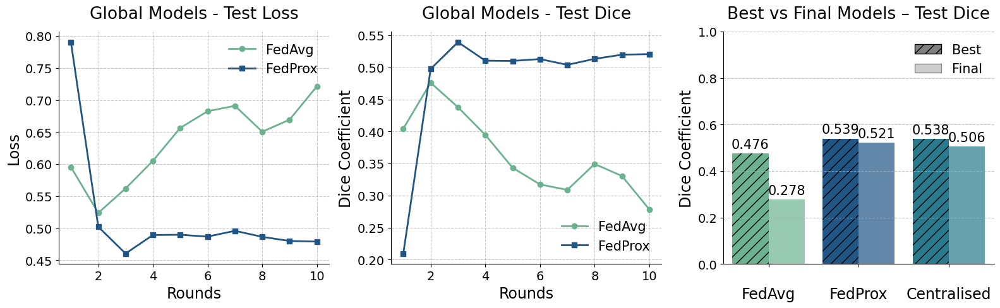

Federated Learning Results
==========================

Import required libraries

.. code:: ipython3

    import os
    import sys
    
    import numpy as np
    
    sys.path.append("/home/mn628/FEDERATED_LEARNING/mn628/")

.. code:: ipython3

    from src.plot_notebooks import *
    from src.seg_fedavg.client import UNetClient
    from src.seg_fedavg.prepare_data import data_loading

Loading and evaluating models on the test set
---------------------------------------------

.. code:: ipython3

    # Path to the results folder
    folder_path = "/home/mn628/FEDERATED_LEARNING/mn628/results/seg_fedavg/normal/"

.. code:: ipython3

    # Set paths to models
    global_model_path = folder_path + "global_model_initial.h5"
    client_0_model_path = folder_path + "client_model_0_initial.h5"
    client_1_model_path = folder_path + "client_model_1_initial.h5"

.. code:: ipython3

    # Load the testing data
    _, _, _, _, test_images, test_masks = data_loading()

.. code:: ipython3

    global_model = UNetClient(None, None, test_images, test_masks)
    global_model.model.load_weights(global_model_path)
    
    client_0_model = UNetClient(None, None, test_images, test_masks)
    client_0_model.model.load_weights(client_0_model_path)
    
    client_1_model = UNetClient(None, None, test_images, test_masks)
    client_1_model.model.load_weights(client_1_model_path)

.. parsed-literal::

    2025-07-03 20:41:26.255174: E tensorflow/compiler/xla/stream_executor/cuda/cuda_driver.cc:266] failed call to cuInit: CUDA_ERROR_NO_DEVICE: no CUDA-capable device is detected
    

.. code:: ipython3

    metrics_global = global_model.evaluate()

.. parsed-literal::

    222/222 [==============================] - 46s 208ms/step
    Loss: 0.6825498335550696, Dice: 0.3174501664449304, IoU: 0.1886720738453185
    

.. code:: ipython3

    metrics_client_0 = client_0_model.evaluate()

.. parsed-literal::

    222/222 [==============================] - 39s 172ms/step
    Loss: 0.6925016781394369, Dice: 0.3074983218605631, IoU: 0.18168272790050952
    

.. code:: ipython3

    metrics_client_1 = client_1_model.evaluate()

.. parsed-literal::

    222/222 [==============================] - 38s 171ms/step
    Loss: 0.6967579194473683, Dice: 0.30324208055263163, IoU: 0.17871852966002197
    

Plotting some results/samples
-----------------------------

.. code:: ipython3

    global_model.save_samples(global_model.x_val, global_model.y_val)

.. parsed-literal::

    222/222 ━━━━━━━━━━━━━━━━━━━━ 59s 266ms/step
    

.. code:: ipython3

    global_model.save_samples(global_model.x_val, global_model.y_val)

.. parsed-literal::

    222/222 ━━━━━━━━━━━━━━━━━━━━ 76s 342ms/step
    

As the examples demonstrate, the models are generally successful in
identifying lesion regions; however, most segmentation inaccuracies are
concentrated around its boundaries. This is particularly relevant
because evaluation metrics such as Dice and IoU are highly sensitive to
even small deviations. Minor over- or under-segmentation in boundary
areas can lead to noticeable performance drops.

Getting training/validation/testing data for plotting
-----------------------------------------------------

Getting training/validation log
^^^^^^^^^^^^^^^^^^^^^^^^^^^^^^^

.. code:: ipython3

    def files(folder_path):
        """List all files in the given folder."""
        txt_files = []
        for filename in os.listdir(folder_path):
            if filename.endswith(".txt") and "timing" not in filename:
                txt_files.append(os.path.join(folder_path, filename))
        txt_files.sort()
        return txt_files

.. code:: ipython3

    txt_files = files(folder_path)

.. code:: ipython3

    def return_metrics(type_met="Training", txt_files=txt_files):
        all_training_loss, all_training_dice, all_training_iou = [], [], []
        for txt_file in txt_files:
            text_data = ""
            with open(txt_file, "r") as file:
                text_data = file.read()
    
            # separate the text data into lines
            lines = text_data.split("\n")
            # save only lines that have training in it
            training_lines = [line for line in lines if type_met in line]
            all_data = [training_lines[i].split(" ") for i in range(len(training_lines))]
            all_data = [
                [all_data[i][-5][:-1], all_data[i][-3][:-1], all_data[i][-1]]
                for i in range(len(all_data))
            ]
            all_data = np.array(all_data)
            # Convert the last column to float
            all_data = all_data.astype(float)
            # Sort the data by the last column (accuracy)
            training_data = all_data.T
            all_training_loss.append(training_data[0])
            all_training_dice.append(training_data[1])
            all_training_iou.append(training_data[2])
        return all_training_loss, all_training_dice, all_training_iou

Training curves
'''''''''''''''

.. code:: ipython3

    all_training_loss, all_training_dice, all_training_iou = return_metrics("Training")

Validation curves
'''''''''''''''''

.. code:: ipython3

    all_validation_loss, all_validation_dice, all_validation_iou = return_metrics(
        "Validation"
    )

Getting global models after each round
^^^^^^^^^^^^^^^^^^^^^^^^^^^^^^^^^^^^^^

.. code:: ipython3

    files = []
    
    for filename in os.listdir(folder_path):
        if "global" in filename and "round" in filename:
            files.append(filename)

.. code:: ipython3

    files.sort(key=lambda x: int(x.split("_")[3].split(".")[0]))
    files

.. parsed-literal::

    ['global_model_round_1.h5',
     'global_model_round_2.h5',
     'global_model_round_3.h5',
     'global_model_round_4.h5',
     'global_model_round_5.h5',
     'global_model_round_6.h5',
     'global_model_round_7.h5',
     'global_model_round_8.h5',
     'global_model_round_9.h5',
     'global_model_round_10.h5']

Evaluating global models after each round on the test set
^^^^^^^^^^^^^^^^^^^^^^^^^^^^^^^^^^^^^^^^^^^^^^^^^^^^^^^^^

.. code:: ipython3

    losses, dices, ious = [], [], []
    for file in files:
        global_model = UNetClient(None, None, test_images, test_masks)
        global_model.load_model(folder_path + file)
    
        metrics = global_model.evaluate()
    
        losses.append(metrics[0])
        dices.append(metrics[2]["dice"])
        ious.append(metrics[2]["iou"])

.. parsed-literal::

    2025-06-02 22:52:22.375091: E external/local_xla/xla/stream_executor/cuda/cuda_driver.cc:152] failed call to cuInit: INTERNAL: CUDA error: Failed call to cuInit: CUDA_ERROR_NO_DEVICE: no CUDA-capable device is detected
    WARNING:absl:Compiled the loaded model, but the compiled metrics have yet to be built. `model.compile_metrics` will be empty until you train or evaluate the model.
    

.. parsed-literal::

    222/222 ━━━━━━━━━━━━━━━━━━━━ 78s 349ms/step
    Loss: 0.49315502626845154, Dice: 0.5068449737315485, IoU: 0.33944564684499395
    

Saved evaluations
^^^^^^^^^^^^^^^^^

Statistical heterogeneity - 2 clients
'''''''''''''''''''''''''''''''''''''

.. code:: ipython3

    all_losses = [
        0.4918422465132526,
        0.5053644437533729,
        0.5309216898889799,
        0.5275375218190329,
        0.576888062258333,
        0.6129822350759203,
        0.5945943296341321,
        0.6269997093186327,
        0.6266085027056808,
        0.6397196138147819,
    ]
    all_dices = [
        0.5081577534867474,
        0.4946355562466272,
        0.46907831011102,
        0.4724624781809671,
        0.42311193774166705,
        0.3870177649240797,
        0.405405670365868,
        0.3730002906813673,
        0.3733914972943192,
        0.3602803861832081,
    ]
    all_ious = [
        0.3406243218238512,
        0.3285819313051773,
        0.3064025503127053,
        0.3092968070717805,
        0.26832084525753164,
        0.23993926064899496,
        0.25423749654176014,
        0.22925651955867604,
        0.22955216124422337,
        0.21644105013311226,
    ]

.. code:: ipython3

    all_losses_prox = [
        0.7374497308667946,
        0.4689179218494973,
        0.4674540615293218,
        0.47737440596346237,
        0.4986523258109651,
        0.47094075994557993,
        0.5029848149285857,
        0.5523412482629448,
        0.46826156896487225,
        0.5197660565363371,
    ]
    all_dices_prox = [
        0.26255026913320545,
        0.5310820781505027,
        0.5325459384706782,
        0.5226255940365376,
        0.5013476741890349,
        0.5290592400544201,
        0.4970151850714143,
        0.44765875173705516,
        0.5317384310351277,
        0.48023394346366294,
    ]
    all_ious_prox = [
        0.15111244053214826,
        0.3615464623658642,
        0.36290467445071517,
        0.35375297685335894,
        0.3345323431955713,
        0.35967406333481,
        0.330685433501888,
        0.2883765101507037,
        0.3621551106932565,
        0.3159920182440137,
    ]

.. code:: ipython3

    max(all_dices), max(all_dices_prox), all_dices[-1], all_dices_prox[-1]

.. parsed-literal::

    (0.5081577534867474,
     0.5325459384706782,
     0.3602803861832081,
     0.48023394346366294)

System heterogeneity - 2 clients
''''''''''''''''''''''''''''''''

.. code:: ipython3

    all_losses = [
        0.9441399168946119,
        0.6826713137071263,
        0.6665240897892144,
        0.7638669224650227,
        0.7244030537657697,
        0.8305009727465805,
        0.879342052893787,
        0.8885188322980514,
        0.8540956429898796,
        0.8086455368777269,
    ]
    all_dices = [
        0.055860083105388154,
        0.31732868629287375,
        0.33347591021078565,
        0.2361330775349773,
        0.2755969462342303,
        0.16949902725341948,
        0.12065794710621303,
        0.11148116770194857,
        0.14590435701012044,
        0.19135446312227314,
    ]
    all_ious = [
        0.028732542663191574,
        0.18858625787930067,
        0.20010266413428468,
        0.13387238828934941,
        0.15982165285104244,
        0.09259707029769788,
        0.06420222807254564,
        0.059031006625595725,
        0.07869300462560705,
        0.1057998702457803,
    ]

.. code:: ipython3

    all_losses_prox = [
        0.7223473049041653,
        0.5108680201664,
        0.5312803590369197,
        0.5101451394728184,
        0.5266132572431959,
        0.5357571204387148,
        0.5099199469047007,
        0.531153019813798,
        0.49374014195583593,
        0.48140478603787706,
    ]
    all_dices_prox = [
        0.27765269509583473,
        0.48913197983359996,
        0.4687196409630802,
        0.48985486052718163,
        0.4733867427568042,
        0.46424287956128524,
        0.49008005309529934,
        0.46884698018620197,
        0.5062598580441641,
        0.5185952139621229,
    ]
    all_ious_prox = [
        0.16120598575284667,
        0.323742360884526,
        0.30609655390465257,
        0.324376013750696,
        0.31008950073685343,
        0.30228925745020574,
        0.3245735339147957,
        0.30620517617711257,
        0.3389209701369411,
        0.35006989234127084,
    ]

.. code:: ipython3

    max(all_dices), max(all_dices_prox), all_dices[-1], all_dices_prox[-1]

.. parsed-literal::

    (0.33347591021078565,
     0.5185952139621229,
     0.19135446312227314,
     0.5185952139621229)

Statistical heterogeneity - 6 clients
'''''''''''''''''''''''''''''''''''''

.. code:: ipython3

    all_losses = [
        0.5955630606206138,
        0.5238971387178559,
        0.5621187490126331,
        0.6052737999908944,
        0.6565788990385023,
        0.6825351827477979,
        0.6910284438482956,
        0.650640495230295,
        0.6694254001209203,
        0.7215551846467692,
    ]
    all_dices = [
        0.4044369393793862,
        0.47610286128214413,
        0.4378812509873668,
        0.3947262000091057,
        0.3434211009614977,
        0.3174648172522021,
        0.3089715561517044,
        0.349359504769705,
        0.3305745998790796,
        0.2784448153532308,
    ]
    all_ious = [
        0.25347599813577754,
        0.312424539154078,
        0.2803123970339246,
        0.2458933796909566,
        0.2073074220375639,
        0.18868242430077503,
        0.18271221709823743,
        0.2116508747841927,
        0.1980169942634965,
        0.161740278694791,
    ]

.. code:: ipython3

    all_losses_prox = [
        0.7904038891393513,
        0.5023571723128164,
        0.4605467163967707,
        0.48947492492338596,
        0.48987074583939516,
        0.48698135684465194,
        0.49598773075435876,
        0.4866258861314485,
        0.4801688417934442,
        0.47923610854868004,
    ]
    all_dices_prox = [
        0.20959611086064864,
        0.4976428276871836,
        0.5394532836032293,
        0.510525075076614,
        0.5101292541606048,
        0.5130186431553481,
        0.5040122692456412,
        0.5133741138685515,
        0.5198311582065558,
        0.52076389145132,
    ]
    all_ious_prox = [
        0.11706638492692376,
        0.3312413564885394,
        0.3693502423079509,
        0.34275506524748905,
        0.3423983292411029,
        0.3450067755011835,
        0.33690936020677836,
        0.34532838332613197,
        0.3511972036762395,
        0.35204920191020483,
    ]

.. code:: ipython3

    max(all_dices), max(all_dices_prox), all_dices[-1], all_dices_prox[-1]

.. parsed-literal::

    (0.47610286128214413, 0.5394532836032293, 0.2784448153532308, 0.52076389145132)

Statistical heterogeneity - 10 clients
''''''''''''''''''''''''''''''''''''''

.. code:: ipython3

    all_losses_prox = [
        0.9948202916562787,
        0.5531843620833923,
        0.5245519977952002,
        0.482727558979796,
        0.4770558892395399,
        0.4823017983057285,
        0.48260241943682014,
        0.4946754479358608,
        0.49315502626845154,
        0.47225667396927895,
    ]
    all_dices_prox = [
        0.005179708343721278,
        0.44681563791660767,
        0.4754480022047997,
        0.517272441020204,
        0.5229441107604601,
        0.5176982016942715,
        0.5173975805631799,
        0.5053245520641392,
        0.5068449737315485,
        0.527743326030721,
    ]
    all_ious_prox = [
        0.0025965789326419073,
        0.28767714176394577,
        0.3118607977244399,
        0.34886546613871394,
        0.3540449041706182,
        0.34925289997354164,
        0.34897931757032874,
        0.33808312885716413,
        0.33944564684499395,
        0.35845877649031,
    ]

.. code:: ipython3

    max(all_dices_prox), all_dices_prox[-1]

.. parsed-literal::

    (0.527743326030721, 0.527743326030721)

Learning curves and comparisons
-------------------------------

Initial federated learning setup - 2 Clients
~~~~~~~~~~~~~~~~~~~~~~~~~~~~~~~~~~~~~~~~~~~~

Federated Learning

.. code:: ipython3

    folder_path = "/home/mn628/FEDERATED_LEARNING/mn628/results/seg_fedavg/normal_2/"
    text_files = files(folder_path)
    
    all_validation_loss, all_validation_dice, all_validation_iou = return_metrics(
        "Validation", text_files
    )

Centralised training

.. code:: ipython3

    unet_history_0 = {}
    with open(
        "/home/mn628/FEDERATED_LEARNING/mn628/results/UNet_segmentation/results_2_equal_clients/unet_history_0.txt",
        "r",
    ) as file:
        lines = file.readlines()
        for line in lines:
            nums = line.strip().split(": ")[1].split("[")[1].split("]")[0].split(", ")
            nums = [float(num) for num in nums if num]
            unet_history_0[line.strip().split(": ")[0]] = nums
    
    unet_history_1 = {}
    with open(
        "/home/mn628/FEDERATED_LEARNING/mn628/results/UNet_segmentation/results_2_equal_clients/unet_history_1.txt",
        "r",
    ) as file:
        lines = file.readlines()
        for line in lines:
            nums = line.strip().split(": ")[1].split("[")[1].split("]")[0].split(", ")
            nums = [float(num) for num in nums if num]
            unet_history_1[line.strip().split(": ")[0]] = nums

.. code:: ipython3

    unet_history_1.keys()

.. parsed-literal::

    dict_keys(['loss', 'dice_coef', 'iou', 'val_loss', 'val_dice_coef', 'val_iou'])

.. code:: ipython3

    federated_initial_comparison(
        unet_history_0, unet_history_1, all_validation_loss, all_validation_dice
    )

It can be observed that centralised training on the second half of the
dataset resulted in a less stable validation loss and Dice curves. When
evaluated, the two centralised models achieved final Dice scores of
0.454 and 0.259, respectively, indicating that the second half of the
dataset is more challenging to learn from. This discrepancy may be
partially attributed to differences in lesion composition across dataset
splits.

When FedAvg was applied to this two-client setup, both clients showed
slightly increasing validation loss over time. Final test Dice scores
were 0.307 and 0.303 for Clients 1 and 2, respectively. While the
federated setup slightly improved Client 2’s performance compared to its
centralised baseline, it came at the cost of reduced accuracy for Client
1 due to naïve averaging. Nonetheless, this initial case demonstrates
the trade-offs and potential benefits of federated learning in scenarios
with imbalanced but moderately overlapping data distributions.

Statistical Heterogeneity - 2 Clients Setup
~~~~~~~~~~~~~~~~~~~~~~~~~~~~~~~~~~~~~~~~~~~

Federated Learning - FedAvg

.. code:: ipython3

    folder_path = (
        "/home/mn628/FEDERATED_LEARNING/mn628/results/seg_fedavg/statistical_het_2/"
    )
    text_files = files(folder_path)
    
    all_validation_loss, all_validation_dice, all_validation_iou = return_metrics(
        "Validation", text_files
    )

FedProx

.. code:: ipython3

    folder_path_prox = (
        "/home/mn628/FEDERATED_LEARNING/mn628/results/seg_fedprox/statistical_het_2/"
    )
    text_files_prox = files(folder_path_prox)
    
    all_validation_loss_prox, all_validation_dice_prox, all_validation_iou_prox = (
        return_metrics("Validation", text_files_prox)
    )

.. code:: ipython3

    epochs = np.arange(1, 31)
    epochs1 = np.arange(1, 31)
    client1_final = [0.389, 0.445, 0.494]
    client2_final = [0.244, 0.349, 0.186]
    fed_2_comparison(
        all_validation_loss,
        all_validation_dice,
        all_validation_loss_prox,
        all_validation_dice_prox,
        client1_final,
        client2_final,
        epochs,
        epochs1,
    )

- As illustrated in figure above, FedProx stabilises the training
  process for both clients, with a more pronounced effect observed for
  Client 2.
- The evaluation of the final models on the test set suggested that: the
  Dice coefficient increased by 5.6% for Client 1 and by 10.5% for
  Client 2. When compared to the performance of the centralised models
  trained on their respective datasets, it is evident that Client 2,
  which was trained on only the last 30% of the data, achieved a
  relatively low Dice score of 0.186.

.. code:: ipython3

    best_dices = [0.5082, 0.5325, 0.538]
    final_dices = [0.3603, 0.4802, 0.5059]
    fed_2_global(
        all_losses, all_dices, all_losses_prox, all_dices_prox, best_dices, final_dices
    )

.. image:: federated_results_files/federated_results_62_0.png

- In the case of FedAvg, the test loss increases and the Dice score
  steadily declines over time (left and middle plots), likely due to one
  client with less data producing updates that diverge significantly
  from the global model.
- In contrast, FedProx demonstrates improved performance, with the Dice
  score gradually increasing across rounds. This indicates that the
  proximal term effectively constrains client updates and mitigates
  divergence from the global objective, particularly in the presence of
  non-IID and imbalanced data.
- The final Dice score improves from 0.36 (FedAvg) to 0.48 (FedProx),
  approaching the 0.506 achieved by the centralised model. In terms of
  best-round performance, FedAvg reaches 0.508 , while FedProx attains
  0.532 , nearly matching the highest score observed in the cenntralised
  setting (0.538 ).

System heterogeneity - 2 Clients Setup
~~~~~~~~~~~~~~~~~~~~~~~~~~~~~~~~~~~~~~

Federated Learning - FedAvg

.. code:: ipython3

    folder_path = "/home/mn628/FEDERATED_LEARNING/mn628/results/seg_fedavg/system_het_2/"
    text_files = files(folder_path)
    
    all_validation_loss, all_validation_dice, all_validation_iou = return_metrics(
        "Validation", text_files
    )

FedProx

.. code:: ipython3

    folder_path_prox = (
        "/home/mn628/FEDERATED_LEARNING/mn628/results/seg_fedprox/system_het_2/"
    )
    text_files_prox = files(folder_path_prox)
    
    all_validation_loss_prox, all_validation_dice_prox, all_validation_iou_prox = (
        return_metrics("Validation", text_files_prox)
    )

Centralised results

.. code:: ipython3

    epochs = np.arange(1, 11)
    epochs1 = np.arange(1, 51)
    client1_final = [0.451, 0.559, 0.558]
    client2_final = [0.011, 0.233, 0.302]
    fed_2_comparison(
        all_validation_loss,
        all_validation_dice,
        all_validation_loss_prox,
        all_validation_dice_prox,
        client1_final,
        client2_final,
        epochs,
        epochs1,
    )

- Due to this larger number of local epochs, Client 2 exhibited clear
  signs of overfitting, with validation performance deteriorating over
  time.
- The introduction of FedProx improved the performance of both clients:
  Client 1’s Dice score reached 0.559, nearly identical to the 0.558
  achieved after 10 epochs of centralised training, while Client 2’s
  score increased substantially from 0.011 to 0.233.
- The issue of overfitting with a large number of local epochs was also
  observed when training a centralised model for 50 epochs on Client 2’s
  dataset, which resulted in a Dice score of 0.302.

.. code:: ipython3

    best_dices = [0.334, 0.519, 0.538]
    final_dices = [0.191, 0.519, 0.506]
    fed_2_global(
        all_losses, all_dices, all_losses_prox, all_dices_prox, best_dices, final_dices
    )

- Similar improvements were observed, where FedProx effectively reduced
  and stabilised the loss after each aggregation round.
- The overall Dice score of the final global model increased
  significantly from 0.191 to 0.519, making its performance comparable
  to that of centralised training.

Statistical Heterogeneity - 6 Clients Setup
~~~~~~~~~~~~~~~~~~~~~~~~~~~~~~~~~~~~~~~~~~~

.. code:: ipython3

    epochs = np.arange(1, 11)
    best_dices = [0.476, 0.539, 0.538]
    final_dices = [0.278, 0.521, 0.506]
    fed_2_global(
        all_losses, all_dices, all_losses_prox, all_dices_prox, best_dices, final_dices
    )

- It is noticeable that under the FedAvg approach, the global model’s
  performance deteriorates significantly over training epochs. Given
  that the data distribution consists of 50% for the first client and
  10% for each of the other five clients, the clients with smaller
  datasets lack sufficient data to learn meaningful patterns. As a
  result, their models converge in widely different directions, causing
  the naive averaging in FedAvg to degrade the global model’s
  performance, which is initially dominated by the client with the
  largest data share. Introducing FedProx stabilises this process,
  leading to consistent small increases in overall test metrics after
  nearly every iteration.
- Regarding the final and best model metrics, FedAvg yields poor final
  results with a Dice score of 0.278 , and a best early training score
  of 0.476 . In contrast, FedProx achieves a final Dice score of 0.521,
  surpassing even the centralised model’s 0.506 . The best FedProx
  performance exceeds the centralised model by 0.1% , demonstrating that
  under this setting the global model trained with FedProx performs
  satisfactorily.

Summary and Comparison of Heterogeneity Experiments
~~~~~~~~~~~~~~~~~~~~~~~~~~~~~~~~~~~~~~~~~~~~~~~~~~~

+-------------+---------+---------+-------+---------+-------+--------+----------+
| Problem     | #       | Method  | Dice  | Dice    | IoU   | IoU    | Time     |
|             | Clients |         | Best  | Final   | Best  | Final  | (h:m:s)  |
+=============+=========+=========+=======+=========+=======+========+==========+
| Statistical | 2       | FedAvg  | 0.508 | 0.360   | 0.340 | 0.220  | 06:12:53 |
+-------------+---------+---------+-------+---------+-------+--------+----------+
|             |         | FedProx | 0.532 | 0.480   | 0.362 | 0.316  | -        |
+-------------+---------+---------+-------+---------+-------+--------+----------+
|             | 6       | FedAvg  | 0.476 | 0.278   | 0.312 | 0.161  | 05:57:11 |
+-------------+---------+---------+-------+---------+-------+--------+----------+
|             |         | FedProx | 0.539 | 0.521   | 0.369 | 0.352  | -        |
+-------------+---------+---------+-------+---------+-------+--------+----------+
|             | 10      | FedAvg  | 0.322 | 0.121   | 0.192 | 0.064  | 03:49:44 |
+-------------+---------+---------+-------+---------+-------+--------+----------+
|             |         | FedProx | 0.528 | 0.528   | 0.359 | 0.359  | -        |
+-------------+---------+---------+-------+---------+-------+--------+----------+
| System      | 2       | FedAvg  | 0.334 | 0.191   | 0.200 | 0.106  | 07:53:35 |
+-------------+---------+---------+-------+---------+-------+--------+----------+
|             |         | FedProx | 0.519 | 0.519   | 0.350 | 0.350  | -        |
+-------------+---------+---------+-------+---------+-------+--------+----------+

Finally, the Table above summarises the results obtained across all
heterogeneity scenarios studied. Both the best and final Dice and IoU
scores are reported, demonstrating consistent improvements achieved by
FedProx in comparison to FedAvg.
