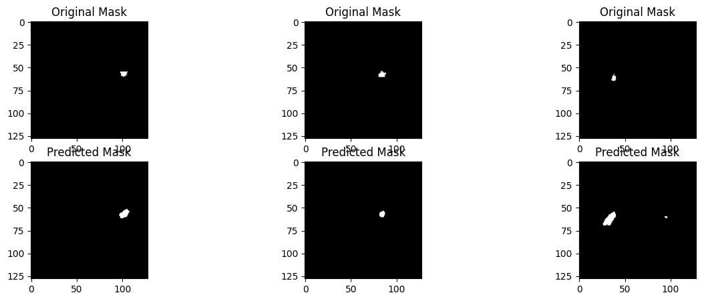
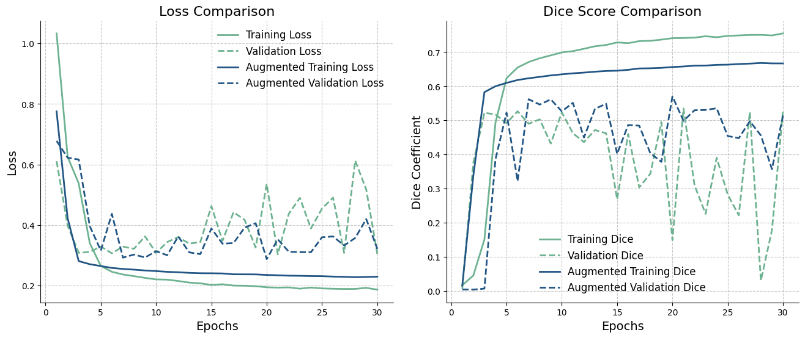

First UNet arhitecture Results
==============================

Import the required libraries

.. code:: ipython3

    import os
    import sys
    
    sys.path.append("/home/mn628/FEDERATED_LEARNING/mn628/")

.. code:: ipython3

    import matplotlib.pyplot as plt
    import numpy as np
    import pandas as pd

.. code:: ipython3

    from configs.unet_config import *
    from src.plot_notebooks import unet_paper_results
    from src.UNet_segmentation.prepare_data import *
    from src.UNet_segmentation.UNet_model import *

Load data
~~~~~~~~~

.. code:: ipython3

    # Load your dataset here
    train_images, train_masks, val_images, val_masks, test_images, test_masks = load_data()

.. code:: ipython3

    # shuffle corresponding images and masks
    train_images, train_masks = shuffle_data(train_images, train_masks)
    val_images, val_masks = shuffle_data(val_images, val_masks)
    test_images, test_masks = shuffle_data(test_images, test_masks)

Evaluation and plotting some segmentation samples
~~~~~~~~~~~~~~~~~~~~~~~~~~~~~~~~~~~~~~~~~~~~~~~~~

Load saved model for the evaluation

.. code:: ipython3

    unet = UNetModel()
    unet.model.load_weights("/home/mn628/FEDERATED_LEARNING/mn628/results/UNet_segmentation/results_2_stat_het/unet_model_1.h5")

.. code:: ipython3

    metrics = unet.evaluate(test_images, test_masks)
    print("Evaluation Metrics:", metrics)

.. parsed-literal::

      2/222 [..............................] - ETA: 1:04222/222 [==============================] - 46s 206ms/step
    Evaluation Metrics: {'accuracy': 0.9981414971423597, 'precision': 0.6635731149846787, 'recall': 0.39438270176669477, 'f1': 0.49473097791739035, 'dice': 0.49473097791739035, 'iou': 0.32866615246815284}
    

.. code:: ipython3

    unet.save_samples(test_images, test_masks)

.. parsed-literal::

    222/222 ━━━━━━━━━━━━━━━━━━━━ 76s 341ms/step
    

Plot learning curves
~~~~~~~~~~~~~~~~~~~~

.. code:: ipython3

    unet_history = {}
    with open(
        "/home/mn628/FEDERATED_LEARNING/mn628/results/UNet_segmentation/centralised/unet_history.txt",
        "r",
    ) as file:
        lines = file.readlines()
        for line in lines:
            nums = line.strip().split(": ")[1].split("[")[1].split("]")[0].split(", ")
            nums = [float(num) for num in nums if num]
            unet_history[line.strip().split(": ")[0]] = nums
    
    unet_aug_history = {}
    with open(
        "/home/mn628/FEDERATED_LEARNING/mn628/results/UNet_segmentation/centralised_augmented/unet_history.txt",
        "r",
    ) as file:
        lines = file.readlines()
        for line in lines:
            nums = line.strip().split(": ")[1].split("[")[1].split("]")[0].split(", ")
            nums = [float(num) for num in nums if num]
            unet_aug_history[line.strip().split(": ")[0]] = nums

.. code:: ipython3

    unet_aug_history.keys()

.. parsed-literal::

    dict_keys(['loss', 'dice_coef', 'iou', 'val_loss', 'val_dice_coef', 'val_iou'])

.. code:: ipython3

    print(max(unet_history["val_dice_coef"]), max(unet_aug_history["val_dice_coef"]))
    print(max(unet_history["val_iou"]), max(unet_aug_history["val_iou"]))

.. parsed-literal::

    0.5347759628295898 0.5703657269477844
    0.3782753551006317 0.39446887373924255
    

.. code:: ipython3

    unet_paper_results(unet_history, unet_aug_history)

- Training with augmentation resulted in a more stable learning curve
  and a smaller gap between training and validation losses, indicating
  reduced overfitting.
- On the test set, the augmented model achieved a Dice score of 0.538,
  improving upon the non-augmented model’s score of 0.505 for 3.3%.
