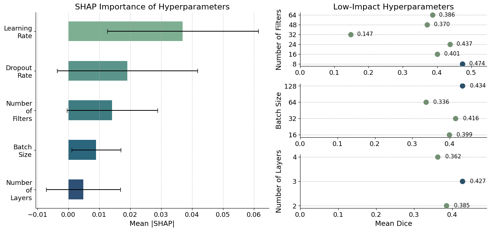

Analysis of the optuna search results
-------------------------------------

Import necessary libraries

.. code:: ipython3

    import sys
    
    import matplotlib.pyplot as plt
    import numpy as np
    import pandas as pd
    import seaborn as sns
    import shap
    from sklearn.utils import resample
    from xgboost import XGBRegressor
    
    sys.path.append("/home/mn628/FEDERATED_LEARNING/mn628/")
    
    from src.plot_notebooks import *

Dataframe containing combination of features and their corresponding
results (obtained after 14 tested configurations):

.. code:: ipython3

    df_features = pd.DataFrame(
        {
            "F1 Score": [
                0.476,
                0.429,
                0.147,
                0.402,
                0.371,
                0.398,
                0.438,
                0.51,
                0.424,
                0.398,
                0.317,
                0.438,
                0.467,
                0.294,
            ],
            "Batch Size": [64, 64, 64, 16, 16, 128, 128, 32, 16, 32, 32, 32, 128, 64],
            "Number of Filters": [24, 16, 32, 16, 16, 24, 8, 8, 48, 64, 48, 24, 64, 64],
            "Dropout Rate": [
                0.361,
                0.454,
                0.232,
                0.327,
                0.488,
                0.377,
                0.437,
                0.31,
                0.41,
                0.201,
                0.243,
                0.284,
                0.305,
                0.378,
            ],
            "Learning Rate": [
                0.0056,
                0.0042,
                0.043,
                0.0006,
                0.0052,
                0.00008,
                0.0013,
                0.00985,
                0.0014,
                0.034,
                0.00001,
                0.01,
                0.013,
                0.075,
            ],
            "Number of Layers": [2, 3, 2, 3, 3, 4, 4, 3, 3, 2, 4, 2, 2, 4],
        }
    )

.. code:: ipython3

    df_features.sort_values(by="F1 Score", ascending=False, inplace=True)
    df_features

.. raw:: html

    

    
    <table border="1" class="dataframe">
      <thead>
        <tr style="text-align: right;">
          <th></th>
          <th>F1 Score</th>
          <th>Batch Size</th>
          <th>Number of Filters</th>
          <th>Dropout Rate</th>
          <th>Learning Rate</th>
          <th>Number of Layers</th>
        </tr>
      </thead>
      <tbody>
        <tr>
          <th>7</th>
          <td>0.510</td>
          <td>32</td>
          <td>8</td>
          <td>0.310</td>
          <td>0.00985</td>
          <td>3</td>
        </tr>
        <tr>
          <th>0</th>
          <td>0.476</td>
          <td>64</td>
          <td>24</td>
          <td>0.361</td>
          <td>0.00560</td>
          <td>2</td>
        </tr>
        <tr>
          <th>12</th>
          <td>0.467</td>
          <td>128</td>
          <td>64</td>
          <td>0.305</td>
          <td>0.01300</td>
          <td>2</td>
        </tr>
        <tr>
          <th>6</th>
          <td>0.438</td>
          <td>128</td>
          <td>8</td>
          <td>0.437</td>
          <td>0.00130</td>
          <td>4</td>
        </tr>
        <tr>
          <th>11</th>
          <td>0.438</td>
          <td>32</td>
          <td>24</td>
          <td>0.284</td>
          <td>0.01000</td>
          <td>2</td>
        </tr>
        <tr>
          <th>1</th>
          <td>0.429</td>
          <td>64</td>
          <td>16</td>
          <td>0.454</td>
          <td>0.00420</td>
          <td>3</td>
        </tr>
        <tr>
          <th>8</th>
          <td>0.424</td>
          <td>16</td>
          <td>48</td>
          <td>0.410</td>
          <td>0.00140</td>
          <td>3</td>
        </tr>
        <tr>
          <th>3</th>
          <td>0.402</td>
          <td>16</td>
          <td>16</td>
          <td>0.327</td>
          <td>0.00060</td>
          <td>3</td>
        </tr>
        <tr>
          <th>5</th>
          <td>0.398</td>
          <td>128</td>
          <td>24</td>
          <td>0.377</td>
          <td>0.00008</td>
          <td>4</td>
        </tr>
        <tr>
          <th>9</th>
          <td>0.398</td>
          <td>32</td>
          <td>64</td>
          <td>0.201</td>
          <td>0.03400</td>
          <td>2</td>
        </tr>
        <tr>
          <th>4</th>
          <td>0.371</td>
          <td>16</td>
          <td>16</td>
          <td>0.488</td>
          <td>0.00520</td>
          <td>3</td>
        </tr>
        <tr>
          <th>10</th>
          <td>0.317</td>
          <td>32</td>
          <td>48</td>
          <td>0.243</td>
          <td>0.00001</td>
          <td>4</td>
        </tr>
        <tr>
          <th>13</th>
          <td>0.294</td>
          <td>64</td>
          <td>64</td>
          <td>0.378</td>
          <td>0.07500</td>
          <td>4</td>
        </tr>
        <tr>
          <th>2</th>
          <td>0.147</td>
          <td>64</td>
          <td>32</td>
          <td>0.232</td>
          <td>0.04300</td>
          <td>2</td>
        </tr>
      </tbody>
    </table>
    

.. code:: ipython3

    X = df_features.drop(columns="F1 Score")  # Model parameters
    y = df_features["F1 Score"]  # Target variable (f1 score)

Bootstrapping for getting the SHAP values

.. code:: ipython3

    bootstrap_shap_vals = []
    n_bootstrap = 1000
    
    for _ in range(n_bootstrap):
        X_boot, y_boot = resample(X, y)
        model = XGBRegressor().fit(X_boot, y_boot)
        explainer = shap.Explainer(model, X)
        shap_values = explainer(X)
        mean_abs_shap = np.abs(shap_values.values).mean(axis=0)
        bootstrap_shap_vals.append(mean_abs_shap)
    
    # Aggregate SHAP stats
    bootstrap_shap_vals = np.array(bootstrap_shap_vals)
    shap_means = bootstrap_shap_vals.mean(axis=0)
    shap_stds = bootstrap_shap_vals.std(axis=0)

.. code:: ipython3

    # Create dataframe for plotting
    shap_df = pd.DataFrame(
        {"Hyperparameter": X.columns, "Mean |SHAP|": shap_means, "Std": shap_stds}
    ).sort_values(by="Mean |SHAP|", ascending=False)
    
    print(shap_df)

.. parsed-literal::

          Hyperparameter  Mean |SHAP|       Std
    3      Learning Rate     0.036974  0.024409
    2       Dropout Rate     0.019072  0.022671
    1  Number of Filters     0.014175  0.014611
    0         Batch Size     0.008969  0.007960
    4   Number of Layers     0.004811  0.011970
    

.. code:: ipython3

    nl_importance = (
        df_features.groupby("Number of Layers")["F1 Score"]
        .mean()
        .sort_values(ascending=False)
    )
    nl_importance = pd.DataFrame(nl_importance)
    nl_importance["Number of repeats"] = (
        df_features["Number of Layers"].value_counts().sort_index()
    )
    nl_importance

.. raw:: html

    

    
    <table border="1" class="dataframe">
      <thead>
        <tr style="text-align: right;">
          <th></th>
          <th>F1 Score</th>
          <th>Number of repeats</th>
        </tr>
        <tr>
          <th>Number of Layers</th>
          <th></th>
          <th></th>
        </tr>
      </thead>
      <tbody>
        <tr>
          <th>3</th>
          <td>0.42720</td>
          <td>5</td>
        </tr>
        <tr>
          <th>2</th>
          <td>0.38520</td>
          <td>5</td>
        </tr>
        <tr>
          <th>4</th>
          <td>0.36175</td>
          <td>4</td>
        </tr>
      </tbody>
    </table>
    

.. code:: ipython3

    bs_importance = (
        df_features.groupby("Batch Size")["F1 Score"].mean().sort_values(ascending=False)
    )
    bs_importance = pd.DataFrame(bs_importance)
    bs_importance["Number of repeats"] = (
        df_features["Batch Size"].value_counts().sort_index()
    )
    bs_importance

.. raw:: html

    

    
    <table border="1" class="dataframe">
      <thead>
        <tr style="text-align: right;">
          <th></th>
          <th>F1 Score</th>
          <th>Number of repeats</th>
        </tr>
        <tr>
          <th>Batch Size</th>
          <th></th>
          <th></th>
        </tr>
      </thead>
      <tbody>
        <tr>
          <th>128</th>
          <td>0.434333</td>
          <td>3</td>
        </tr>
        <tr>
          <th>32</th>
          <td>0.415750</td>
          <td>4</td>
        </tr>
        <tr>
          <th>16</th>
          <td>0.399000</td>
          <td>3</td>
        </tr>
        <tr>
          <th>64</th>
          <td>0.336500</td>
          <td>4</td>
        </tr>
      </tbody>
    </table>
    

.. code:: ipython3

    nf_importance = (
        df_features.groupby("Number of Filters")["F1 Score"]
        .mean()
        .sort_values(ascending=False)
    )
    nf_importance = pd.DataFrame(nf_importance)
    nf_importance["Number of repeats"] = (
        df_features["Number of Filters"].value_counts().sort_index()
    )
    nf_importance

.. raw:: html

    

    
    <table border="1" class="dataframe">
      <thead>
        <tr style="text-align: right;">
          <th></th>
          <th>F1 Score</th>
          <th>Number of repeats</th>
        </tr>
        <tr>
          <th>Number of Filters</th>
          <th></th>
          <th></th>
        </tr>
      </thead>
      <tbody>
        <tr>
          <th>8</th>
          <td>0.474000</td>
          <td>2</td>
        </tr>
        <tr>
          <th>24</th>
          <td>0.437333</td>
          <td>3</td>
        </tr>
        <tr>
          <th>16</th>
          <td>0.400667</td>
          <td>3</td>
        </tr>
        <tr>
          <th>64</th>
          <td>0.386333</td>
          <td>3</td>
        </tr>
        <tr>
          <th>48</th>
          <td>0.370500</td>
          <td>2</td>
        </tr>
        <tr>
          <th>32</th>
          <td>0.147000</td>
          <td>1</td>
        </tr>
      </tbody>
    </table>
    

.. code:: ipython3

    low_params = shap_df.tail(3)
    top_params = shap_df.head(2)
    
    print(top_params)
    print("-------------------------------------------")
    print(low_params)

.. parsed-literal::

      Hyperparameter  Mean |SHAP|       Std
    3  Learning Rate     0.036974  0.024409
    2   Dropout Rate     0.019072  0.022671
    -------------------------------------------
          Hyperparameter  Mean |SHAP|       Std
    1  Number of Filters     0.014175  0.014611
    0         Batch Size     0.008969  0.007960
    4   Number of Layers     0.004811  0.011970
    

.. code:: ipython3

    grouped_data = {}
    for param in low_params["Hyperparameter"].values:
        # Calculate mean f1 for each value of the parameter
        grouped = df_features.groupby(param)["F1 Score"].mean().sort_values(ascending=False)
    
        # Count how many times each value appears
        counts = df_features[param].value_counts().sort_index()
    
        # Create dataframe with both mean f1 and count
        df = grouped.to_frame("mean_f1")
        df["count"] = counts.loc[df.index].values
    
        # Store in dictionary
        grouped_data[param] = df

.. code:: ipython3

    SHAP_analysis(shap_df, low_params, grouped_data)

- The learning rate had the highest influence, with a mean SHAP value of
  0.037, followed by dropout with a mean SHAP value of 0.019.
- These two parameters were selected for further tuning while the
  remaining ones (number of layers, base number of filters, and batch
  size) were fixed to the values that yielded the highest mean Dice
  scores, highlighted on the right-hand side of the figure above.
- After evaluating an additional 14 configurations, the final U-Net
  architecture was found to perform best with a learning rate of 0.001,
  a dropout rate of 0.3, three convolutional layers, a base of eight
  filters, and a batch size of 128 , all contributing to faster and more
  stable training.
