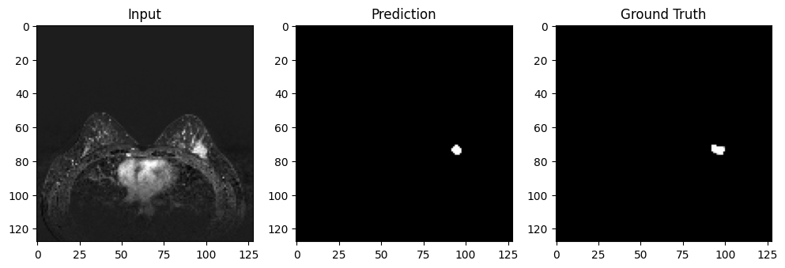
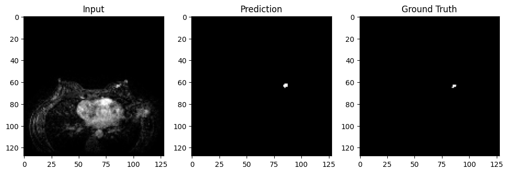

Pretrained Unet ResNet34 arhitecture Results
============================================

Import the required libraries

.. code:: ipython3

    import os
    import sys
    
    sys.path.append("/home/mn628/FEDERATED_LEARNING/mn628")

.. code:: ipython3

    import matplotlib.pyplot as plt
    import numpy as np
    import pandas as pd
    from tensorflow.keras.models import load_model

.. code:: ipython3

    from configs.pretrained_config import *
    from src.pretrained_model.evaluate import *
    from src.pretrained_model.train import *

Load data
~~~~~~~~~

.. code:: ipython3

    # Load your dataset here
    train_images = np.load(base_path + "train_images.npy")
    train_masks = np.load(base_path + "train_masks.npy")
    val_images = np.load(base_path + "val_images.npy")
    val_masks = np.load(base_path + "val_masks.npy")
    test_images = np.load(base_path + "test_images.npy")
    test_masks = np.load(base_path + "test_masks.npy")

.. code:: ipython3

    # shuffle corresponding images and masks
    idx = np.random.permutation(len(train_images))
    train_images = train_images[idx]
    train_masks = train_masks[idx]
    train_images, train_masks = np.array(train_images), np.array(train_masks)
    
    idx = np.random.permutation(len(val_images))
    val_images = val_images[idx]
    val_masks = val_masks[idx]
    val_images, val_masks = np.array(val_images), np.array(val_masks)
    
    idx = np.random.permutation(len(test_images))
    test_images = test_images[idx]
    test_masks = test_masks[idx]
    test_images, test_masks = np.array(test_images), np.array(test_masks)

Evaluation
~~~~~~~~~~

.. code:: ipython3

    # Load model
    model = load_trained_model(BEST_MODEL)

.. code:: ipython3

    evaluate_model(model, test_images, test_masks)

.. parsed-literal::

    222/222 [==============================] - 473s 2s/step
    IoU: 0.363, Dice: 0.532
    

.. code:: ipython3

    evaluate_model(model, val_images, val_masks)

.. parsed-literal::

    63/63 [==============================] - 136s 2s/step
    IoU: 0.354, Dice: 0.523
    

