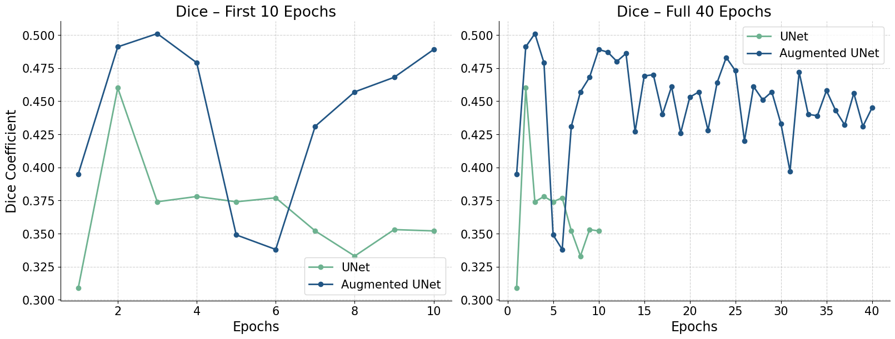

Second UNet arhitecture Results
===============================

Import the required libraries

.. code:: ipython3

    import os
    import sys
    
    sys.path.append("/home/mn628/FEDERATED_LEARNING/mn628")

.. code:: ipython3

    import matplotlib.pyplot as plt
    import netron
    import numpy as np
    import seaborn as sns
    import torch
    from torchviz import make_dot
    
    from configs.unet_paper_config import train_save
    from src.plot_notebooks import unet_paper_aug_comparison
    from src.UNet_paper.prepare_data import *
    from src.UNet_paper.train_and_eval import (create_lr_scheduler, evaluate,
                                               train_one_epoch)
    from src.UNet_paper.unet import UNet

Model arhitecture info and visualisation
~~~~~~~~~~~~~~~~~~~~~~~~~~~~~~~~~~~~~~~~

One image, could’ve been just a random dummy input

.. code:: ipython3

    train_images = np.load(train_save)
    train_images = np.transpose(train_images, (0, 3, 1, 2))[:1]
    train_images.shape

.. parsed-literal::

    (1, 1, 128, 128)

.. code:: ipython3

    dummy_input = torch.from_numpy(train_images).float()

Model

.. code:: ipython3

    model = UNet(in_channels=1, num_classes=1, bilinear=True)
    output = model(dummy_input)

Visualisation 1

.. code:: ipython3

    dot = make_dot(output["out"], params=dict(model.named_parameters()))
    dot.render(
        "/home/mn628/FEDERATED_LEARNING/mn628/results/UNet_paper/unet_architecture",
        format="png",
    )

.. parsed-literal::

    '/home/mn628/FEDERATED_LEARNING/mn628/results/UNet_paper/unet_architecture.png'

Visualisation 2 (open with Netron)

.. code:: ipython3

    onnx_path = "/home/mn628/FEDERATED_LEARNING/mn628/results/UNet_paper/unet_model.onnx"
    torch.onnx.export(
        model,
        dummy_input,
        onnx_path,
        input_names=["input"],
        output_names=["output"],
        opset_version=11,
        verbose=True,
    )

Model info

.. code:: ipython3

    print(model)

.. parsed-literal::

    UNet(
      (in_conv): DoubleConv(
        (0): Conv2d(1, 32, kernel_size=(3, 3), stride=(1, 1), padding=(1, 1), bias=False)
        (1): BatchNorm2d(32, eps=1e-05, momentum=0.1, affine=True, track_running_stats=True)
        (2): ReLU(inplace=True)
        (3): Conv2d(32, 32, kernel_size=(3, 3), stride=(1, 1), padding=(1, 1), bias=False)
        (4): BatchNorm2d(32, eps=1e-05, momentum=0.1, affine=True, track_running_stats=True)
        (5): ReLU(inplace=True)
      )
      (down1): Down(
        (0): MaxPool2d(kernel_size=2, stride=2, padding=0, dilation=1, ceil_mode=False)
        (1): DoubleConv(
          (0): Conv2d(32, 64, kernel_size=(3, 3), stride=(1, 1), padding=(1, 1), bias=False)
          (1): BatchNorm2d(64, eps=1e-05, momentum=0.1, affine=True, track_running_stats=True)
          (2): ReLU(inplace=True)
          (3): Conv2d(64, 64, kernel_size=(3, 3), stride=(1, 1), padding=(1, 1), bias=False)
          (4): BatchNorm2d(64, eps=1e-05, momentum=0.1, affine=True, track_running_stats=True)
          (5): ReLU(inplace=True)
        )
      )
      (down2): Down(
        (0): MaxPool2d(kernel_size=2, stride=2, padding=0, dilation=1, ceil_mode=False)
        (1): DoubleConv(
          (0): Conv2d(64, 128, kernel_size=(3, 3), stride=(1, 1), padding=(1, 1), bias=False)
          (1): BatchNorm2d(128, eps=1e-05, momentum=0.1, affine=True, track_running_stats=True)
          (2): ReLU(inplace=True)
          (3): Conv2d(128, 128, kernel_size=(3, 3), stride=(1, 1), padding=(1, 1), bias=False)
          (4): BatchNorm2d(128, eps=1e-05, momentum=0.1, affine=True, track_running_stats=True)
          (5): ReLU(inplace=True)
        )
      )
      (down3): Down(
        (0): MaxPool2d(kernel_size=2, stride=2, padding=0, dilation=1, ceil_mode=False)
        (1): DoubleConv(
          (0): Conv2d(128, 256, kernel_size=(3, 3), stride=(1, 1), padding=(1, 1), bias=False)
          (1): BatchNorm2d(256, eps=1e-05, momentum=0.1, affine=True, track_running_stats=True)
          (2): ReLU(inplace=True)
          (3): Conv2d(256, 256, kernel_size=(3, 3), stride=(1, 1), padding=(1, 1), bias=False)
          (4): BatchNorm2d(256, eps=1e-05, momentum=0.1, affine=True, track_running_stats=True)
          (5): ReLU(inplace=True)
        )
      )
      (down4): Down(
        (0): MaxPool2d(kernel_size=2, stride=2, padding=0, dilation=1, ceil_mode=False)
        (1): DoubleConv(
          (0): Conv2d(256, 256, kernel_size=(3, 3), stride=(1, 1), padding=(1, 1), bias=False)
          (1): BatchNorm2d(256, eps=1e-05, momentum=0.1, affine=True, track_running_stats=True)
          (2): ReLU(inplace=True)
          (3): Conv2d(256, 256, kernel_size=(3, 3), stride=(1, 1), padding=(1, 1), bias=False)
          (4): BatchNorm2d(256, eps=1e-05, momentum=0.1, affine=True, track_running_stats=True)
          (5): ReLU(inplace=True)
        )
      )
      (up1): Up(
        (up): Upsample(scale_factor=2.0, mode='bilinear')
        (conv): DoubleConv(
          (0): Conv2d(512, 256, kernel_size=(3, 3), stride=(1, 1), padding=(1, 1), bias=False)
          (1): BatchNorm2d(256, eps=1e-05, momentum=0.1, affine=True, track_running_stats=True)
          (2): ReLU(inplace=True)
          (3): Conv2d(256, 128, kernel_size=(3, 3), stride=(1, 1), padding=(1, 1), bias=False)
          (4): BatchNorm2d(128, eps=1e-05, momentum=0.1, affine=True, track_running_stats=True)
          (5): ReLU(inplace=True)
        )
      )
      (up2): Up(
        (up): Upsample(scale_factor=2.0, mode='bilinear')
        (conv): DoubleConv(
          (0): Conv2d(256, 128, kernel_size=(3, 3), stride=(1, 1), padding=(1, 1), bias=False)
          (1): BatchNorm2d(128, eps=1e-05, momentum=0.1, affine=True, track_running_stats=True)
          (2): ReLU(inplace=True)
          (3): Conv2d(128, 64, kernel_size=(3, 3), stride=(1, 1), padding=(1, 1), bias=False)
          (4): BatchNorm2d(64, eps=1e-05, momentum=0.1, affine=True, track_running_stats=True)
          (5): ReLU(inplace=True)
        )
      )
      (up3): Up(
        (up): Upsample(scale_factor=2.0, mode='bilinear')
        (conv): DoubleConv(
          (0): Conv2d(128, 64, kernel_size=(3, 3), stride=(1, 1), padding=(1, 1), bias=False)
          (1): BatchNorm2d(64, eps=1e-05, momentum=0.1, affine=True, track_running_stats=True)
          (2): ReLU(inplace=True)
          (3): Conv2d(64, 32, kernel_size=(3, 3), stride=(1, 1), padding=(1, 1), bias=False)
          (4): BatchNorm2d(32, eps=1e-05, momentum=0.1, affine=True, track_running_stats=True)
          (5): ReLU(inplace=True)
        )
      )
      (up4): Up(
        (up): Upsample(scale_factor=2.0, mode='bilinear')
        (conv): DoubleConv(
          (0): Conv2d(64, 32, kernel_size=(3, 3), stride=(1, 1), padding=(1, 1), bias=False)
          (1): BatchNorm2d(32, eps=1e-05, momentum=0.1, affine=True, track_running_stats=True)
          (2): ReLU(inplace=True)
          (3): Conv2d(32, 32, kernel_size=(3, 3), stride=(1, 1), padding=(1, 1), bias=False)
          (4): BatchNorm2d(32, eps=1e-05, momentum=0.1, affine=True, track_running_stats=True)
          (5): ReLU(inplace=True)
        )
      )
      (out_conv): OutConv(
        (0): Conv2d(32, 1, kernel_size=(1, 1), stride=(1, 1))
      )
    )
    

Augmentation comparison - validation learning curves
~~~~~~~~~~~~~~~~~~~~~~~~~~~~~~~~~~~~~~~~~~~~~~~~~~~~

.. code:: ipython3

    unet_loss, unet_dice = [], []
    with open(
        "/home/mn628/FEDERATED_LEARNING/mn628/results/UNet_paper/results/results.txt", "r"
    ) as file:
        lines = file.readlines()
        for line in lines:
            if "dice coefficient" in line:
                unet_dice.append(float(line.split(":")[-1].strip()))
            if "loss" in line:
                unet_loss.append(float(line.split(":")[-1].strip()))
    
    unet_augmented_loss, unet_augmented_dice = [], []
    with open(
        "/home/mn628/FEDERATED_LEARNING/mn628/results/UNet_paper/results/results_augmented.txt",
        "r",
    ) as file:
        lines = file.readlines()
        for line in lines:
            if "dice coefficient" in line:
                unet_augmented_dice.append(float(line.split(":")[-1].strip()))
            if "loss" in line:
                unet_augmented_loss.append(float(line.split(":")[-1].strip()))

.. code:: ipython3

    print(max(unet_dice), max(unet_augmented_dice), unet_dice[-1], unet_augmented_dice[-1])

.. parsed-literal::

    0.46 0.501 0.352 0.445
    

.. code:: ipython3

    unet_paper_aug_comparison(unet_dice, unet_augmented_dice)

It is evident that after a certain number of epochs, the non-augmented
model’s performance achieves a noticeably lower value. The final
validation Dice scores were 0.352 for the non-augmented model and 0.445
for the augmented model, confirming the benefit of augmentation.

Consequently, only the augmented model was selected for extended
training up to 40 epochs, resulting in a best test Dice score of 0.575 .

Evaluation on the test data
~~~~~~~~~~~~~~~~~~~~~~~~~~~

.. code:: ipython3

    # load the test images and masks
    test_images, test_masks = np.load(
        "/home/mn628/FEDERATED_LEARNING/data/test_images.npy"
    ), np.load("/home/mn628/FEDERATED_LEARNING/data/test_masks.npy")
    val_images, val_masks = np.load(
        "/home/mn628/FEDERATED_LEARNING/data/val_images.npy"
    ), np.load("/home/mn628/FEDERATED_LEARNING/data/val_masks.npy")

.. code:: ipython3

    # load the models
    model = UNet(in_channels=1, num_classes=2, base_c=32)
    model_aug = UNet(in_channels=1, num_classes=2, base_c=32)
    
    checkpoint = torch.load(
        "/home/mn628/FEDERATED_LEARNING/mn628/results/UNet_paper/save_weights/best_model.pth",
        map_location="cpu",
        weights_only=False,
    )
    checkpoint_aug = torch.load(
        "/home/mn628/FEDERATED_LEARNING/mn628/results/UNet_paper/save_weights/best_model_augmented.pth",
        map_location="cpu",
        weights_only=False,
    )
    
    model.load_state_dict(checkpoint["model"]), model_aug.load_state_dict(
        checkpoint_aug["model"]
    )
    model.to("cpu"), model_aug.to("cpu")
    
    print("Models loaded successfully.")

.. parsed-literal::

    Models loaded successfully.
    

.. code:: ipython3

    test_images.shape, test_masks.shape

.. parsed-literal::

    ((7089, 128, 128, 1), (7089, 128, 128, 1))

.. code:: ipython3

    # test_images, test_masks = test_images[:1000], test_masks[:1000]

.. code:: ipython3

    # prepare data - dimension adaptation
    test_images, test_masks = np.transpose(test_images, (0, 3, 1, 2)), np.transpose(
        test_masks, (0, 3, 1, 2)
    )
    test_masks = test_masks[:, 0, :, :]
    
    test_images, test_masks = torch.tensor(test_images), torch.tensor(test_masks)
    
    # shuffle the dataset
    test_images, test_masks = shuffle_manual(test_images, test_masks)
    
    # create dataloaders
    test_dataset = torch.utils.data.TensorDataset(
        torch.tensor(test_images), torch.tensor(test_masks)
    )
    
    test_images = torch.utils.data.DataLoader(test_dataset, batch_size=64, shuffle=True)

Evaluate the augmented model on the test set.

.. code:: ipython3

    confmat_aug, dice_aug = evaluate(model_aug, test_images, device="cpu", num_classes=2)
    
    # print and save results
    val_info_aug = str(confmat_aug)
    print(val_info_aug)
    print(f"dice coefficient: {dice_aug:.3f}")

.. parsed-literal::

    Test:  [  0/111]  eta: 0:07:38    time: 4.1283  data: 0.0056
    Test:  [100/111]  eta: 0:00:44    time: 4.0041  data: 0.0017
    Test: Total time: 0:07:27
    global correct: 99.8
    average row correct: ['99.9', '62.0']
    IoU: ['99.8', '41.8']
    mean IoU: 70.8
    dice coefficient: 0.575
    

.. code:: ipython3

    # prepare data - dimension adaptation
    val_images, val_masks = np.transpose(val_images, (0, 3, 1, 2)), np.transpose(
        val_masks, (0, 3, 1, 2)
    )
    val_masks = val_masks[:, 0, :, :]
    
    val_images, val_masks = torch.tensor(val_images), torch.tensor(val_masks)
    
    # shuffle the dataset
    val_images, val_masks = shuffle_manual(val_images, val_masks)
    
    # create dataloaders
    test_dataset = torch.utils.data.TensorDataset(
        torch.tensor(val_images), torch.tensor(val_masks)
    )
    
    val_images = torch.utils.data.DataLoader(test_dataset, batch_size=64, shuffle=True)

Evaluate the non-augmented model on the validation set.

.. code:: ipython3

    confmat_val, dice_val = evaluate(model, val_images, device="cpu", num_classes=2)
    
    # print and save results
    val_info_val = str(confmat_val)
    print(val_info_val)
    print(f"dice coefficient: {dice_val:.3f}")

.. parsed-literal::

    Test:  [ 0/32]  eta: 0:02:06    time: 3.9676  data: 0.0031
    Test: Total time: 0:02:04
    global correct: 99.8
    average row correct: ['99.9', '60.6']
    IoU: ['99.8', '35.1']
    mean IoU: 67.5
    dice coefficient: 0.454
    

Evaluate the augmented model on the validation set.

.. code:: ipython3

    confmat_val_aug, dice_val_aug = evaluate(
        model_aug, val_images, device="cpu", num_classes=2
    )
    
    # print and save results
    val_info_val_aug = str(confmat_val_aug)
    print(val_info_val_aug)
    print(f"dice coefficient: {dice_val_aug:.3f}")

.. parsed-literal::

    Test:  [ 0/32]  eta: 0:02:05    time: 3.9206  data: 0.0032
    Test: Total time: 0:02:03
    global correct: 99.8
    average row correct: ['99.9', '58.1']
    IoU: ['99.8', '36.7']
    mean IoU: 68.3
    dice coefficient: 0.481
    
